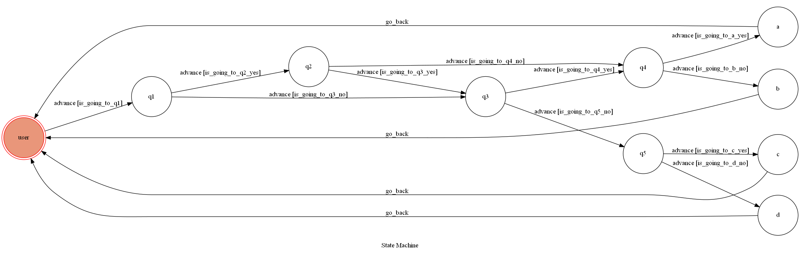

# psychological test
A Line bot based on a finite state machine.

play a psychological test.

## Finite State Machine

## Usage
The initial state is set to `user`.

enter start to start a psychological test.

question 1 enter "yes" to question2 , enter "no" to question3.

question 2 enter "yes" to question3 , enter "no" to question4.

question 3 enter "yes" to question4 , enter "no" to question5.

question 4 enter "yes" to result A , enter "no" to result B.

question 5 enter "yes" to result C , enter "no" to result D.

## Deploy
Setting to deploy webhooks on AWS.
